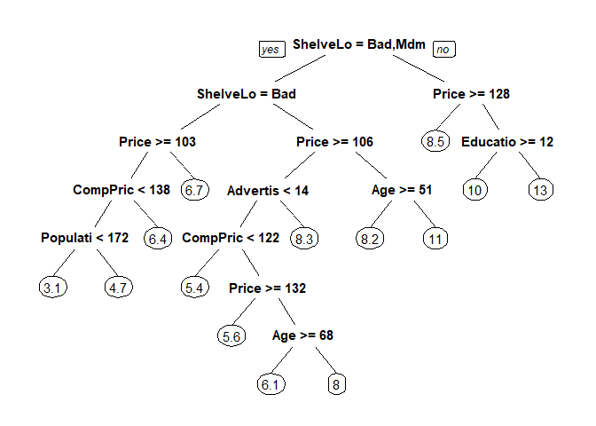
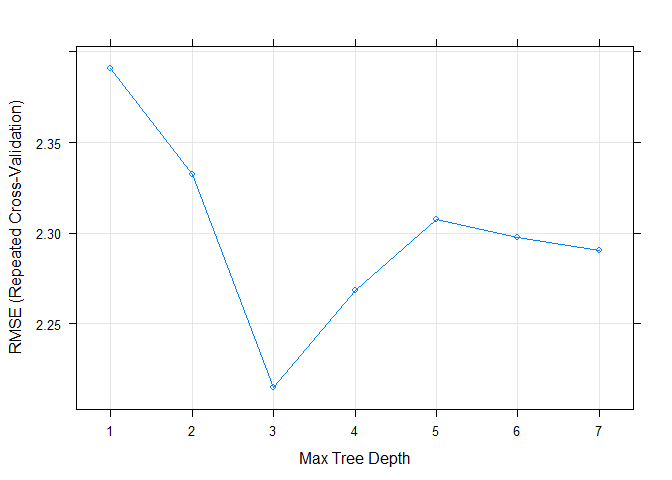

Homework 4: Bags, Forests, Boosts, oh my
================
Jason Carlson
2/28/2019

Problem 1
---------

Problem 7 from Chapter 8 in the text. To be specific, please use a sequence of `ntree` from 25 to 500 in steps of 25 and `mtry` from 3 to 9 for by 1.

Answer 1
--------

``` r
set.seed(1234)
df <- tbl_df(Boston)

for (k in 1:20){
  inTraining <- createDataPartition(df$medv, p = .75, list = F)
  training <- df[inTraining, ]
  testing <- df[-inTraining, ]
  mtry <- c(3:9)
  ntree <- seq(25, 500, len = 20)
  results <- tibble(trial = rep(NA, 140),
  mtry = rep(NA, 140),
  ntree = rep(NA, 140),
  mse = rep(NA, 140)) 
  for(i in 1:7){
    cat(sprintf('Trial: %s, mtry: %s --- %s\n', k, mtry[i], Sys.time()))
    for(j in 1:20){ 
      rf_train <- randomForest(medv ~ .,
                               data = training,
                               mtry = mtry[i],
                               ntree = ntree[j])
      mse <- mean((predict(rf_train, newdata = testing) - testing$medv)^2)
      results[(i-1)*20 + j, ] <- c(k, mtry[i], ntree[j], mse)
    }
  }
  if(exists("results_total")){
  results_total <- bind_rows(results_total, results)
  }
  else(
  results_total <- results
  )
}
```

    ## Trial: 1, mtry: 3 --- 2019-03-16 14:26:32
    ## Trial: 1, mtry: 4 --- 2019-03-16 14:26:35
    ## Trial: 1, mtry: 5 --- 2019-03-16 14:26:39
    ## Trial: 1, mtry: 6 --- 2019-03-16 14:26:43
    ## Trial: 1, mtry: 7 --- 2019-03-16 14:26:48
    ## Trial: 1, mtry: 8 --- 2019-03-16 14:26:53
    ## Trial: 1, mtry: 9 --- 2019-03-16 14:26:59
    ## Trial: 2, mtry: 3 --- 2019-03-16 14:27:05
    ## Trial: 2, mtry: 4 --- 2019-03-16 14:27:08
    ## Trial: 2, mtry: 5 --- 2019-03-16 14:27:12
    ## Trial: 2, mtry: 6 --- 2019-03-16 14:27:16
    ## Trial: 2, mtry: 7 --- 2019-03-16 14:27:20
    ## Trial: 2, mtry: 8 --- 2019-03-16 14:27:26
    ## Trial: 2, mtry: 9 --- 2019-03-16 14:27:32
    ## Trial: 3, mtry: 3 --- 2019-03-16 14:27:38
    ## Trial: 3, mtry: 4 --- 2019-03-16 14:27:41
    ## Trial: 3, mtry: 5 --- 2019-03-16 14:27:44
    ## Trial: 3, mtry: 6 --- 2019-03-16 14:27:48
    ## Trial: 3, mtry: 7 --- 2019-03-16 14:27:53
    ## Trial: 3, mtry: 8 --- 2019-03-16 14:27:58
    ## Trial: 3, mtry: 9 --- 2019-03-16 14:28:04
    ## Trial: 4, mtry: 3 --- 2019-03-16 14:28:11
    ## Trial: 4, mtry: 4 --- 2019-03-16 14:28:14
    ## Trial: 4, mtry: 5 --- 2019-03-16 14:28:17
    ## Trial: 4, mtry: 6 --- 2019-03-16 14:28:21
    ## Trial: 4, mtry: 7 --- 2019-03-16 14:28:26
    ## Trial: 4, mtry: 8 --- 2019-03-16 14:28:31
    ## Trial: 4, mtry: 9 --- 2019-03-16 14:28:37
    ## Trial: 5, mtry: 3 --- 2019-03-16 14:28:44
    ## Trial: 5, mtry: 4 --- 2019-03-16 14:28:47
    ## Trial: 5, mtry: 5 --- 2019-03-16 14:28:50
    ## Trial: 5, mtry: 6 --- 2019-03-16 14:28:54
    ## Trial: 5, mtry: 7 --- 2019-03-16 14:28:59
    ## Trial: 5, mtry: 8 --- 2019-03-16 14:29:04
    ## Trial: 5, mtry: 9 --- 2019-03-16 14:29:10
    ## Trial: 6, mtry: 3 --- 2019-03-16 14:29:17
    ## Trial: 6, mtry: 4 --- 2019-03-16 14:29:19
    ## Trial: 6, mtry: 5 --- 2019-03-16 14:29:23
    ## Trial: 6, mtry: 6 --- 2019-03-16 14:29:27
    ## Trial: 6, mtry: 7 --- 2019-03-16 14:29:32
    ## Trial: 6, mtry: 8 --- 2019-03-16 14:29:37
    ## Trial: 6, mtry: 9 --- 2019-03-16 14:29:43
    ## Trial: 7, mtry: 3 --- 2019-03-16 14:29:50
    ## Trial: 7, mtry: 4 --- 2019-03-16 14:29:52
    ## Trial: 7, mtry: 5 --- 2019-03-16 14:29:56
    ## Trial: 7, mtry: 6 --- 2019-03-16 14:30:00
    ## Trial: 7, mtry: 7 --- 2019-03-16 14:30:05
    ## Trial: 7, mtry: 8 --- 2019-03-16 14:30:10
    ## Trial: 7, mtry: 9 --- 2019-03-16 14:30:16
    ## Trial: 8, mtry: 3 --- 2019-03-16 14:30:22
    ## Trial: 8, mtry: 4 --- 2019-03-16 14:30:25
    ## Trial: 8, mtry: 5 --- 2019-03-16 14:30:28
    ## Trial: 8, mtry: 6 --- 2019-03-16 14:30:33
    ## Trial: 8, mtry: 7 --- 2019-03-16 14:30:37
    ## Trial: 8, mtry: 8 --- 2019-03-16 14:30:42
    ## Trial: 8, mtry: 9 --- 2019-03-16 14:30:48
    ## Trial: 9, mtry: 3 --- 2019-03-16 14:30:55
    ## Trial: 9, mtry: 4 --- 2019-03-16 14:30:58
    ## Trial: 9, mtry: 5 --- 2019-03-16 14:31:01
    ## Trial: 9, mtry: 6 --- 2019-03-16 14:31:05
    ## Trial: 9, mtry: 7 --- 2019-03-16 14:31:10
    ## Trial: 9, mtry: 8 --- 2019-03-16 14:31:15
    ## Trial: 9, mtry: 9 --- 2019-03-16 14:31:21
    ## Trial: 10, mtry: 3 --- 2019-03-16 14:31:27
    ## Trial: 10, mtry: 4 --- 2019-03-16 14:31:30
    ## Trial: 10, mtry: 5 --- 2019-03-16 14:31:33
    ## Trial: 10, mtry: 6 --- 2019-03-16 14:31:37
    ## Trial: 10, mtry: 7 --- 2019-03-16 14:31:42
    ## Trial: 10, mtry: 8 --- 2019-03-16 14:31:47
    ## Trial: 10, mtry: 9 --- 2019-03-16 14:31:53
    ## Trial: 11, mtry: 3 --- 2019-03-16 14:32:00
    ## Trial: 11, mtry: 4 --- 2019-03-16 14:32:03
    ## Trial: 11, mtry: 5 --- 2019-03-16 14:32:06
    ## Trial: 11, mtry: 6 --- 2019-03-16 14:32:10
    ## Trial: 11, mtry: 7 --- 2019-03-16 14:32:15
    ## Trial: 11, mtry: 8 --- 2019-03-16 14:32:20
    ## Trial: 11, mtry: 9 --- 2019-03-16 14:32:26
    ## Trial: 12, mtry: 3 --- 2019-03-16 14:32:33
    ## Trial: 12, mtry: 4 --- 2019-03-16 14:32:36
    ## Trial: 12, mtry: 5 --- 2019-03-16 14:32:39
    ## Trial: 12, mtry: 6 --- 2019-03-16 14:32:43
    ## Trial: 12, mtry: 7 --- 2019-03-16 14:32:48
    ## Trial: 12, mtry: 8 --- 2019-03-16 14:32:53
    ## Trial: 12, mtry: 9 --- 2019-03-16 14:32:59
    ## Trial: 13, mtry: 3 --- 2019-03-16 14:33:06
    ## Trial: 13, mtry: 4 --- 2019-03-16 14:33:08
    ## Trial: 13, mtry: 5 --- 2019-03-16 14:33:12
    ## Trial: 13, mtry: 6 --- 2019-03-16 14:33:16
    ## Trial: 13, mtry: 7 --- 2019-03-16 14:33:21
    ## Trial: 13, mtry: 8 --- 2019-03-16 14:33:26
    ## Trial: 13, mtry: 9 --- 2019-03-16 14:33:32
    ## Trial: 14, mtry: 3 --- 2019-03-16 14:33:38
    ## Trial: 14, mtry: 4 --- 2019-03-16 14:33:41
    ## Trial: 14, mtry: 5 --- 2019-03-16 14:33:44
    ## Trial: 14, mtry: 6 --- 2019-03-16 14:33:48
    ## Trial: 14, mtry: 7 --- 2019-03-16 14:33:53
    ## Trial: 14, mtry: 8 --- 2019-03-16 14:33:58
    ## Trial: 14, mtry: 9 --- 2019-03-16 14:34:04
    ## Trial: 15, mtry: 3 --- 2019-03-16 14:34:10
    ## Trial: 15, mtry: 4 --- 2019-03-16 14:34:13
    ## Trial: 15, mtry: 5 --- 2019-03-16 14:34:17
    ## Trial: 15, mtry: 6 --- 2019-03-16 14:34:21
    ## Trial: 15, mtry: 7 --- 2019-03-16 14:34:25
    ## Trial: 15, mtry: 8 --- 2019-03-16 14:34:31
    ## Trial: 15, mtry: 9 --- 2019-03-16 14:34:36
    ## Trial: 16, mtry: 3 --- 2019-03-16 14:34:43
    ## Trial: 16, mtry: 4 --- 2019-03-16 14:34:46
    ## Trial: 16, mtry: 5 --- 2019-03-16 14:34:49
    ## Trial: 16, mtry: 6 --- 2019-03-16 14:34:53
    ## Trial: 16, mtry: 7 --- 2019-03-16 14:34:58
    ## Trial: 16, mtry: 8 --- 2019-03-16 14:35:03
    ## Trial: 16, mtry: 9 --- 2019-03-16 14:35:09
    ## Trial: 17, mtry: 3 --- 2019-03-16 14:35:15
    ## Trial: 17, mtry: 4 --- 2019-03-16 14:35:18
    ## Trial: 17, mtry: 5 --- 2019-03-16 14:35:22
    ## Trial: 17, mtry: 6 --- 2019-03-16 14:35:26
    ## Trial: 17, mtry: 7 --- 2019-03-16 14:35:30
    ## Trial: 17, mtry: 8 --- 2019-03-16 14:35:36
    ## Trial: 17, mtry: 9 --- 2019-03-16 14:35:42
    ## Trial: 18, mtry: 3 --- 2019-03-16 14:35:48
    ## Trial: 18, mtry: 4 --- 2019-03-16 14:35:51
    ## Trial: 18, mtry: 5 --- 2019-03-16 14:35:54
    ## Trial: 18, mtry: 6 --- 2019-03-16 14:35:58
    ## Trial: 18, mtry: 7 --- 2019-03-16 14:36:03
    ## Trial: 18, mtry: 8 --- 2019-03-16 14:36:08
    ## Trial: 18, mtry: 9 --- 2019-03-16 14:36:14
    ## Trial: 19, mtry: 3 --- 2019-03-16 14:36:21
    ## Trial: 19, mtry: 4 --- 2019-03-16 14:36:23
    ## Trial: 19, mtry: 5 --- 2019-03-16 14:36:27
    ## Trial: 19, mtry: 6 --- 2019-03-16 14:36:31
    ## Trial: 19, mtry: 7 --- 2019-03-16 14:36:35
    ## Trial: 19, mtry: 8 --- 2019-03-16 14:36:41
    ## Trial: 19, mtry: 9 --- 2019-03-16 14:36:46
    ## Trial: 20, mtry: 3 --- 2019-03-16 14:36:53
    ## Trial: 20, mtry: 4 --- 2019-03-16 14:36:56
    ## Trial: 20, mtry: 5 --- 2019-03-16 14:36:59
    ## Trial: 20, mtry: 6 --- 2019-03-16 14:37:03
    ## Trial: 20, mtry: 7 --- 2019-03-16 14:37:08
    ## Trial: 20, mtry: 8 --- 2019-03-16 14:37:14
    ## Trial: 20, mtry: 9 --- 2019-03-16 14:37:20

Problem 2
---------

Problem 8 from Chapter 8 in the text. Set your seed with 9823 and split into train/test using 50% of your data in each split. In addition to parts (a) - (e), do the following: \#A

``` r
set.seed(9823)
df <- tbl_df(Carseats)
inTraining <- createDataPartition(df$Sales, p = .5, list = F)
training <- df[inTraining, ]
testing  <- df[-inTraining, ]
```

B
=

``` r
carseats_tree <- rpart(Sales ~ ., data = training)
prp(carseats_tree)
```



``` r
summary(carseats_tree)
```

    ## Call:
    ## rpart(formula = Sales ~ ., data = training)
    ##   n= 201 
    ## 
    ##            CP nsplit rel error    xerror       xstd
    ## 1  0.23155949      0 1.0000000 1.0173468 0.09708974
    ## 2  0.12226232      1 0.7684405 0.8555409 0.07828876
    ## 3  0.09172973      2 0.6461782 0.7218100 0.06677113
    ## 4  0.03533612      3 0.5544484 0.6239798 0.05599835
    ## 5  0.03433475      4 0.5191123 0.7008466 0.06537458
    ## 6  0.03003688      5 0.4847776 0.7115057 0.06797243
    ## 7  0.02823833      6 0.4547407 0.6966850 0.06851981
    ## 8  0.02671147      7 0.4265024 0.7006259 0.06910021
    ## 9  0.02151143      8 0.3997909 0.6807879 0.06912370
    ## 10 0.01799895      9 0.3782795 0.7180768 0.07159743
    ## 11 0.01200941     11 0.3422816 0.7059585 0.06945401
    ## 12 0.01033541     12 0.3302722 0.7122929 0.07028484
    ## 13 0.01000000     13 0.3199367 0.7076406 0.07023507
    ## 
    ## Variable importance
    ##   ShelveLoc       Price   CompPrice         Age  Population   Education 
    ##          41          23          11           7           5           5 
    ## Advertising      Income 
    ##           4           4 
    ## 
    ## Node number 1: 201 observations,    complexity param=0.2315595
    ##   mean=7.465721, MSE=7.428204 
    ##   left son=2 (162 obs) right son=3 (39 obs)
    ##   Primary splits:
    ##       ShelveLoc   splits as  LRL,       improve=0.23155950, (0 missing)
    ##       Price       < 129.5 to the right, improve=0.13414320, (0 missing)
    ##       Advertising < 13.5  to the left,  improve=0.09155010, (0 missing)
    ##       Age         < 61.5  to the right, improve=0.05517630, (0 missing)
    ##       US          splits as  LR,        improve=0.03545178, (0 missing)
    ## 
    ## Node number 2: 162 observations,    complexity param=0.1222623
    ##   mean=6.822222, MSE=5.749911 
    ##   left son=4 (49 obs) right son=5 (113 obs)
    ##   Primary splits:
    ##       ShelveLoc   splits as  L-R,       improve=0.19597310, (0 missing)
    ##       Price       < 105.5 to the right, improve=0.18264610, (0 missing)
    ##       Advertising < 11.5  to the left,  improve=0.07161144, (0 missing)
    ##       Age         < 63.5  to the right, improve=0.05718564, (0 missing)
    ##       Income      < 116.5 to the left,  improve=0.04340843, (0 missing)
    ##   Surrogate splits:
    ##       CompPrice  < 93.5  to the left,  agree=0.704, adj=0.02, (0 split)
    ##       Population < 14.5  to the left,  agree=0.704, adj=0.02, (0 split)
    ## 
    ## Node number 3: 39 observations,    complexity param=0.03533612
    ##   mean=10.13872, MSE=5.534591 
    ##   left son=6 (13 obs) right son=7 (26 obs)
    ##   Primary splits:
    ##       Price       < 127.5 to the right, improve=0.2444267, (0 missing)
    ##       US          splits as  LR,        improve=0.1751606, (0 missing)
    ##       Advertising < 0.5   to the left,  improve=0.1675706, (0 missing)
    ##       Education   < 11.5  to the right, improve=0.1537685, (0 missing)
    ##       Population  < 356   to the left,  improve=0.1463307, (0 missing)
    ##   Surrogate splits:
    ##       Income    < 30.5  to the left,  agree=0.744, adj=0.231, (0 split)
    ##       CompPrice < 149   to the right, agree=0.718, adj=0.154, (0 split)
    ##       Age       < 34    to the left,  agree=0.718, adj=0.154, (0 split)
    ## 
    ## Node number 4: 49 observations,    complexity param=0.03003688
    ##   mean=5.210204, MSE=4.903508 
    ##   left son=8 (35 obs) right son=9 (14 obs)
    ##   Primary splits:
    ##       Price       < 102.5 to the right, improve=0.18665160, (0 missing)
    ##       Income      < 95.5  to the left,  improve=0.18458130, (0 missing)
    ##       Education   < 11.5  to the left,  improve=0.13839380, (0 missing)
    ##       Population  < 185.5 to the left,  improve=0.12645500, (0 missing)
    ##       Advertising < 11.5  to the left,  improve=0.07818734, (0 missing)
    ##   Surrogate splits:
    ##       CompPrice  < 112.5 to the right, agree=0.816, adj=0.357, (0 split)
    ##       Age        < 75.5  to the left,  agree=0.776, adj=0.214, (0 split)
    ##       Income     < 27    to the right, agree=0.755, adj=0.143, (0 split)
    ##       Population < 496.5 to the left,  agree=0.735, adj=0.071, (0 split)
    ## 
    ## Node number 5: 113 observations,    complexity param=0.09172973
    ##   mean=7.521239, MSE=4.501483 
    ##   left son=10 (73 obs) right son=11 (40 obs)
    ##   Primary splits:
    ##       Price       < 105.5 to the right, improve=0.26925010, (0 missing)
    ##       Income      < 57.5  to the left,  improve=0.11786330, (0 missing)
    ##       Age         < 60.5  to the right, improve=0.11445890, (0 missing)
    ##       Advertising < 6.5   to the left,  improve=0.09124711, (0 missing)
    ##       CompPrice   < 115.5 to the left,  improve=0.04636677, (0 missing)
    ##   Surrogate splits:
    ##       CompPrice  < 120.5 to the right, agree=0.699, adj=0.15, (0 split)
    ##       Population < 80    to the right, agree=0.681, adj=0.10, (0 split)
    ##       Income     < 118.5 to the left,  agree=0.664, adj=0.05, (0 split)
    ## 
    ## Node number 6: 13 observations
    ##   mean=8.493846, MSE=3.219254 
    ## 
    ## Node number 7: 26 observations,    complexity param=0.02671147
    ##   mean=10.96115, MSE=4.663056 
    ##   left son=14 (17 obs) right son=15 (9 obs)
    ##   Primary splits:
    ##       Education   < 11.5  to the right, improve=0.3289528, (0 missing)
    ##       CompPrice   < 120.5 to the left,  improve=0.2320853, (0 missing)
    ##       Advertising < 0.5   to the left,  improve=0.1510274, (0 missing)
    ##       Price       < 108.5 to the right, improve=0.1324465, (0 missing)
    ##       Population  < 312.5 to the left,  improve=0.1093973, (0 missing)
    ##   Surrogate splits:
    ##       CompPrice  < 135   to the left,  agree=0.769, adj=0.333, (0 split)
    ##       Price      < 93.5  to the right, agree=0.769, adj=0.333, (0 split)
    ##       Population < 416   to the left,  agree=0.731, adj=0.222, (0 split)
    ##       Income     < 36.5  to the right, agree=0.692, adj=0.111, (0 split)
    ## 
    ## Node number 8: 35 observations,    complexity param=0.02151143
    ##   mean=4.605143, MSE=3.748665 
    ##   left son=16 (27 obs) right son=17 (8 obs)
    ##   Primary splits:
    ##       CompPrice < 137.5 to the left,  improve=0.2447961, (0 missing)
    ##       Price     < 143.5 to the right, improve=0.1786213, (0 missing)
    ##       Education < 11.5  to the left,  improve=0.1692974, (0 missing)
    ##       Age       < 44    to the right, improve=0.1435586, (0 missing)
    ##       Income    < 58.5  to the right, improve=0.1297241, (0 missing)
    ##   Surrogate splits:
    ##       Income    < 41    to the right, agree=0.8, adj=0.125, (0 split)
    ##       Education < 17.5  to the left,  agree=0.8, adj=0.125, (0 split)
    ## 
    ## Node number 9: 14 observations
    ##   mean=6.722857, MSE=4.587249 
    ## 
    ## Node number 10: 73 observations,    complexity param=0.02823833
    ##   mean=6.706301, MSE=3.290895 
    ##   left son=20 (59 obs) right son=21 (14 obs)
    ##   Primary splits:
    ##       Advertising < 13.5  to the left,  improve=0.17550200, (0 missing)
    ##       Income      < 59    to the left,  improve=0.13442920, (0 missing)
    ##       CompPrice   < 121.5 to the left,  improve=0.13058810, (0 missing)
    ##       Age         < 48.5  to the right, improve=0.12723440, (0 missing)
    ##       Price       < 136   to the right, improve=0.04860137, (0 missing)
    ## 
    ## Node number 11: 40 observations,    complexity param=0.03433475
    ##   mean=9.0085, MSE=3.286838 
    ##   left son=22 (27 obs) right son=23 (13 obs)
    ##   Primary splits:
    ##       Age         < 50.5  to the right, improve=0.3899200, (0 missing)
    ##       CompPrice   < 117.5 to the left,  improve=0.3136527, (0 missing)
    ##       Advertising < 5.5   to the left,  improve=0.1404600, (0 missing)
    ##       Income      < 55    to the left,  improve=0.1330976, (0 missing)
    ##       Price       < 96.5  to the right, improve=0.1321742, (0 missing)
    ##   Surrogate splits:
    ##       CompPrice   < 125.5 to the left,  agree=0.775, adj=0.308, (0 split)
    ##       Population  < 32    to the right, agree=0.725, adj=0.154, (0 split)
    ##       Advertising < 17.5  to the left,  agree=0.700, adj=0.077, (0 split)
    ##       Education   < 16.5  to the left,  agree=0.700, adj=0.077, (0 split)
    ## 
    ## Node number 14: 17 observations
    ##   mean=10.06, MSE=3.393306 
    ## 
    ## Node number 15: 9 observations
    ##   mean=12.66333, MSE=2.630133 
    ## 
    ## Node number 16: 27 observations,    complexity param=0.01033541
    ##   mean=4.083704, MSE=2.696394 
    ##   left son=32 (10 obs) right son=33 (17 obs)
    ##   Primary splits:
    ##       Population < 171.5 to the left,  improve=0.21196320, (0 missing)
    ##       Price      < 139.5 to the right, improve=0.18986180, (0 missing)
    ##       Education  < 11.5  to the left,  improve=0.18936010, (0 missing)
    ##       Income     < 64.5  to the right, improve=0.15477380, (0 missing)
    ##       Age        < 42.5  to the right, improve=0.09996678, (0 missing)
    ##   Surrogate splits:
    ##       Advertising < 1.5   to the left,  agree=0.778, adj=0.4, (0 split)
    ##       Price       < 149.5 to the right, agree=0.741, adj=0.3, (0 split)
    ##       Education   < 16.5  to the right, agree=0.741, adj=0.3, (0 split)
    ##       Age         < 68.5  to the right, agree=0.704, adj=0.2, (0 split)
    ## 
    ## Node number 17: 8 observations
    ##   mean=6.365, MSE=3.285325 
    ## 
    ## Node number 20: 59 observations,    complexity param=0.01799895
    ##   mean=6.336102, MSE=2.802651 
    ##   left son=40 (18 obs) right son=41 (41 obs)
    ##   Primary splits:
    ##       CompPrice   < 121.5 to the left,  improve=0.13130470, (0 missing)
    ##       Age         < 27.5  to the right, improve=0.11301050, (0 missing)
    ##       Price       < 131.5 to the right, improve=0.08968463, (0 missing)
    ##       Income      < 59    to the left,  improve=0.08736340, (0 missing)
    ##       Advertising < 6.5   to the left,  improve=0.06259425, (0 missing)
    ##   Surrogate splits:
    ##       Price      < 114.5 to the left,  agree=0.831, adj=0.444, (0 split)
    ##       Income     < 111.5 to the right, agree=0.712, adj=0.056, (0 split)
    ##       Population < 31.5  to the left,  agree=0.712, adj=0.056, (0 split)
    ##       Age        < 32    to the left,  agree=0.712, adj=0.056, (0 split)
    ## 
    ## Node number 21: 14 observations
    ##   mean=8.266429, MSE=2.336937 
    ## 
    ## Node number 22: 27 observations
    ##   mean=8.222963, MSE=2.030821 
    ## 
    ## Node number 23: 13 observations
    ##   mean=10.64, MSE=1.952092 
    ## 
    ## Node number 32: 10 observations
    ##   mean=3.098, MSE=2.886056 
    ## 
    ## Node number 33: 17 observations
    ##   mean=4.663529, MSE=1.677093 
    ## 
    ## Node number 40: 18 observations
    ##   mean=5.420556, MSE=0.8434497 
    ## 
    ## Node number 41: 41 observations,    complexity param=0.01799895
    ##   mean=6.738049, MSE=3.133225 
    ##   left son=82 (16 obs) right son=83 (25 obs)
    ##   Primary splits:
    ##       Price       < 131.5 to the right, improve=0.24937500, (0 missing)
    ##       Age         < 48.5  to the right, improve=0.14544350, (0 missing)
    ##       Income      < 59    to the left,  improve=0.12444810, (0 missing)
    ##       Advertising < 6.5   to the left,  improve=0.07810302, (0 missing)
    ##       CompPrice   < 131.5 to the right, improve=0.05041991, (0 missing)
    ##   Surrogate splits:
    ##       CompPrice  < 140   to the right, agree=0.805, adj=0.500, (0 split)
    ##       Education  < 16.5  to the right, agree=0.683, adj=0.188, (0 split)
    ##       Income     < 114.5 to the right, agree=0.659, adj=0.125, (0 split)
    ##       Population < 437   to the right, agree=0.659, adj=0.125, (0 split)
    ## 
    ## Node number 82: 16 observations
    ##   mean=5.633125, MSE=2.359334 
    ## 
    ## Node number 83: 25 observations,    complexity param=0.01200941
    ##   mean=7.4452, MSE=2.347105 
    ##   left son=166 (7 obs) right son=167 (18 obs)
    ##   Primary splits:
    ##       Age         < 68    to the right, improve=0.30558290, (0 missing)
    ##       Advertising < 6     to the left,  improve=0.28734230, (0 missing)
    ##       Urban       splits as  LR,        improve=0.18450460, (0 missing)
    ##       Income      < 87.5  to the right, improve=0.10393110, (0 missing)
    ##       Price       < 121.5 to the right, improve=0.08411169, (0 missing)
    ##   Surrogate splits:
    ##       Income      < 101   to the right, agree=0.84, adj=0.429, (0 split)
    ##       Advertising < 1     to the left,  agree=0.80, adj=0.286, (0 split)
    ##       Population  < 384.5 to the right, agree=0.76, adj=0.143, (0 split)
    ## 
    ## Node number 166: 7 observations
    ##   mean=6.087143, MSE=0.8713061 
    ## 
    ## Node number 167: 18 observations
    ##   mean=7.973333, MSE=1.924867

``` r
#MSE=7.428204
```

C
=

``` r
fit_control <- trainControl(method = "repeatedcv",
                           number = 10, 
                           repeats = 10)
cv_carseat_tree <- train(Sales ~ ., 
                        data = training,
                        method = "rpart2", 
                        trControl = fit_control,
                        tuneGrid = data.frame(maxdepth = 1:7))
plot(cv_carseat_tree)
```



``` r
test_preds <- predict(cv_carseat_tree, newdata = testing)
carseat_test_df <- testing %>%
  mutate(y_hat = test_preds,
         sq_err = (y_hat - Sales)^2)
mean(carseat_test_df$sq_err)
```

    ## [1] 4.933184

``` r
#MSE: 4.933184
#Cross Validation improved MSE
```

D
=

``` r
bag_carseat <- randomForest(Sales ~ ., data = training, mtry = 10, importance=TRUE)

bag_preds <- predict(bag_carseat, newdata = testing)
mean((bag_preds - testing$Sales)^2)
```

    ## [1] 3.025916

``` r
#MSE: 3.073112

importance(bag_carseat)
```

    ##               %IncMSE IncNodePurity
    ## CompPrice   20.941065    139.432654
    ## Income       8.944824    121.451852
    ## Advertising 14.003362    114.933576
    ## Population  -2.033770     50.077638
    ## Price       46.774186    337.518330
    ## ShelveLoc   54.249126    496.660018
    ## Age         13.936498    110.110312
    ## Education    7.989915     52.047857
    ## Urban       -1.104463      6.504596
    ## US           6.471637     19.654236

``` r
#ShelveLoc and Price are the most important variables (highest %IncMSE)
```

E
=

``` r
mseDF<-NA
for (i in 1:10){
  rforest_carseats <-  randomForest(Sales ~ . , data=training, 
                             mtry=i, ntree=500, importance=TRUE)
  rforest_pred <-  predict(rforest_carseats, testing)
  mseDF[i] <- mean((testing$Sales - rforest_pred)^2)
}

bestM=which.min(mseDF)
bestM
```

    ## [1] 9

``` r
mseDF[bestM]
```

    ## [1] 3.020779

``` r
best_rforest_carseats <-  randomForest(Sales ~ . , data=training, 
                             mtry=bestM, ntree=500, importance=TRUE)
importance(best_rforest_carseats)
```

    ##               %IncMSE IncNodePurity
    ## CompPrice   20.259728    141.256864
    ## Income       9.404271    119.760927
    ## Advertising 14.130208    116.847552
    ## Population  -2.241361     54.059470
    ## Price       46.247398    335.000228
    ## ShelveLoc   51.861250    500.595465
    ## Age         14.178941    104.905811
    ## Education    6.231061     57.614917
    ## Urban       -3.256085      6.408037
    ## US           4.225264     16.008544

``` r
#ShelveLoc and Price are still the two most important variables

#The best M varies between 7-10 (for the times I have ran the loop to find it. The best MSE I found was using M=9 resulting in MSE of 2.99
```

1.  Fit a gradient-boosted tree to the training data and report the estimated test MSE.

``` r
carseats.boost<-gbm(Sales ~ . ,data = training,distribution = "gaussian",n.trees = 10000,
                  shrinkage = 0.01, interaction.depth = 4)
carseats_boost_tree <- rpart::rpart(Sales ~ . , 
                      data = training,
                      control = rpart.control(minsplit = 50))

boost_preds <- predict(carseats_boost_tree, newdata = testing)
mean((boost_preds - testing$Sales)^2)
```

    ## [1] 5.428695

``` r
#5.428695
```

1.  Fit a multiple regression model to the training data and report the estimated test MSE

``` r
fit_control <- trainControl(method = "repeatedcv",
                          number = 10, 
                           repeats = 10)


carseat_mult <- train(Sales ~ .,
                          data = training,
                          method = "svmPoly",
                          trControl = fit_control,
                         tuneGrid = expand.grid(degree = 2:4,
                                                scale = c(.001, .01, .1), 
                                                 C = 2:8))
carseat_mult_preds<-predict(carseat_mult, newdata = testing)
```

1.  Summarize your results.

``` r
mean((carseat_mult_preds - testing$Sales)^2)
```

    ## [1] 1.118513

``` r
#MSE: 1.104752
#The multiple regression model is by far the best out of all models as it has the lowest MSE (1.104752)
```
